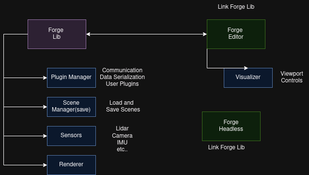

# Forge
Robot Visualizer/Simulator


<p align="center">
    
</p>


This project is an open-source initiative designed to simulate and visualize robots. I aim for it to have a solid foundation, including a renderer and a plugin system with an easy-to-use interface. It is intended to be a standalone project, not part of a larger library like ROS. You will implement your own plugin for communication, and there will be a predefined set of sensors, such as LiDAR, cameras, and IMU.

<p align="center">
    
</p>


## Getting the Simulator

### Compiling from Source

Start by cloning the repository using the `--recursive` flag, as there are submodules that need to be downloaded along with the main code.

We use CMake as the build system, so please install it along with a compiler or an IDE (for Windows).

- **Linux:**

  Just run this script:
  ```bash
  ./build.sh
  ```

- **Windows:**

  Open the root directory in any IDE and configure the project using CMake. We recommend CLion.

## Community and Contributing

The main goal of this project is to create a strong foundation for participating in various competitions. If you'd like to join us, you're more than welcome!
